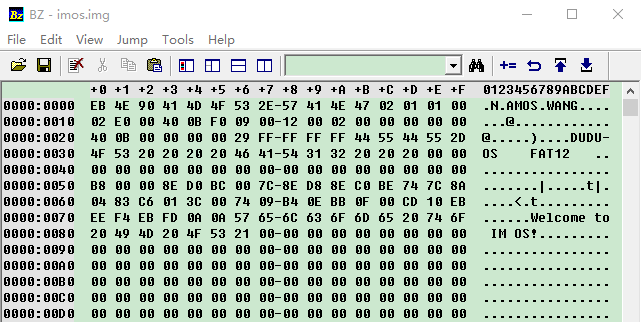
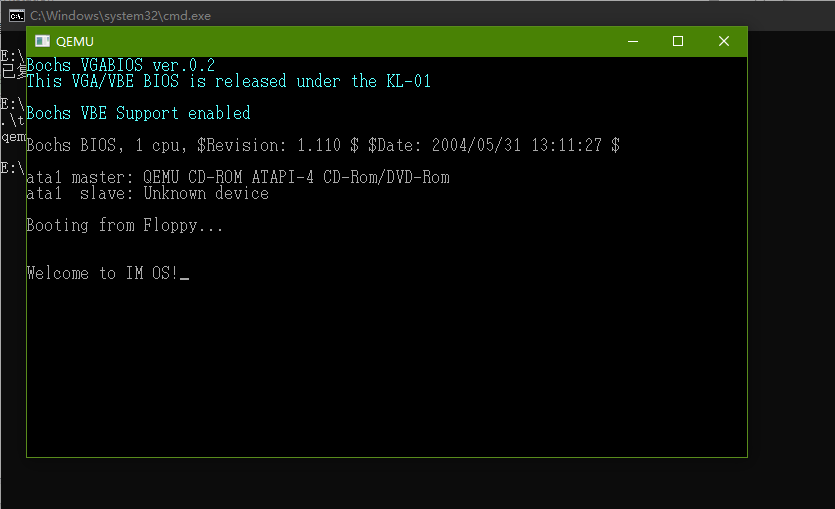
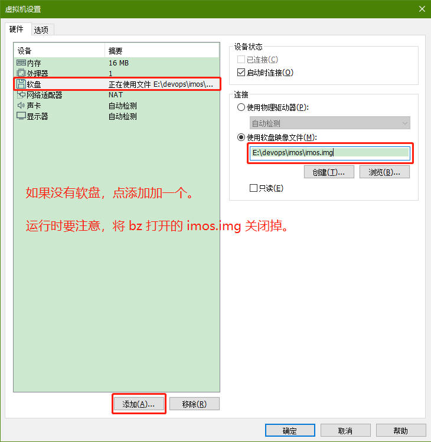
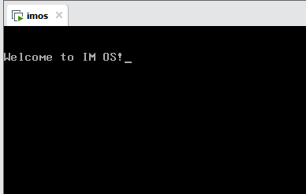

# IMOS

> by《30天自制操作系统》川合秀实

## 基础准备

- 操作系统：Windows

- [Binary Editor 二进制编辑器](./backup/Bz1621.zip)

- [tolset 工具包](./backup/tolset.zip)

---

## 小目录

1. [汇编 `asm` 入门](./src/nask_1/)

---

## 1、Hello World

### 1.1 编辑  imos.img

### 1.2 运行 imos.img

`run.bat`

### 1.3 通过 VMware 运行

